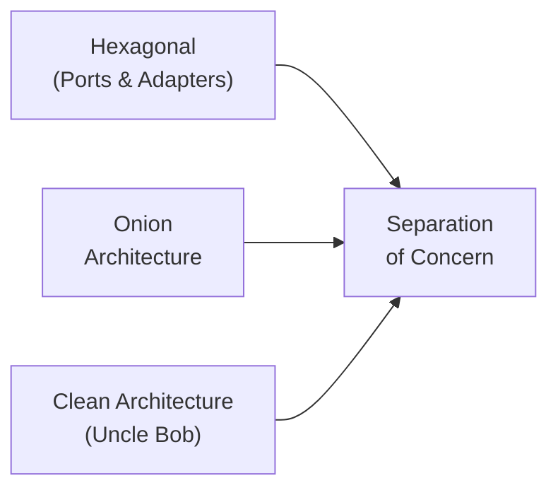
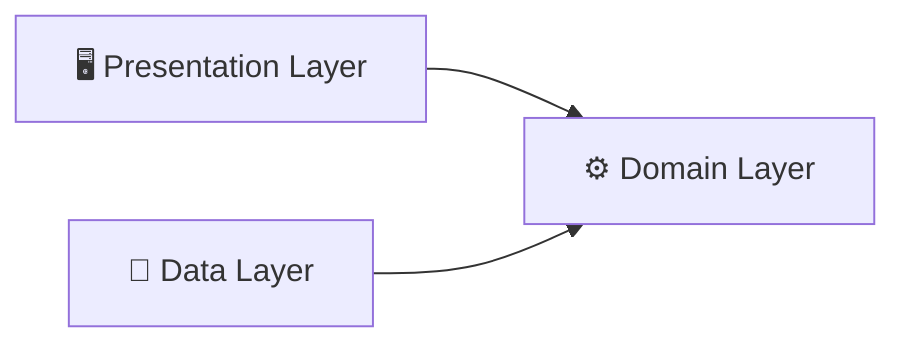

# Clean Architecture on Android

---

## 1. Clean Architecture?

- Sebelum Clean Architecture dari Uncle Bob, sudah ada banyak architecture yang **hampir sama**
- Contoh: **Hexagonal Architecture**, **Onion Architecture**, **Screaming Architecture**
- Berbeda di beberapa detail, tapi **satu tujuan yang sama**:

> **Separation of Concern** — membagi aplikasi menjadi beberapa layer



---

## 2. Why Separation of Concern?

Agar aplikasi kita bisa:

| Benefit | Penjelasan |
|---|---|
| **Testable** | Mudah dibuat mock karena masing-masing layer **tidak dependent** ke layer lain |
| **Maintainable** | Ada masalah di layer presentation? Fokus di situ saja. Layer lain **tidak terganggu** |
| **Scalable** | Tambah/kurangi feature? Hanya layer yang berkaitan yang dirubah. Layer lain **tidak terpengaruh** |

---

## 3. Separation of Concern on Android

- Tim Google punya pemikiran **sendiri** tentang clean architecture di Android
- **Tidak bisa disamakan** dengan Clean Architecture Uncle Bob
- Alasan: Android hanya **front-end**, kebanyakan business logic sudah di-handle **backend**
- Arsitektur dipermudah agar **tidak terlalu boilerplate** dan **overengineering** (YAGNI)

Google menyarankan hanya **3 layer**:



> Presentation dan Data **bergantung** ke Domain. Domain **tidak bergantung** ke siapapun.

---

## 4. Multi Module Architecture

### Kenapa butuh multi module?

1. **Enforce Separation of Concern**
   - Single module → mudah melanggar aturan, tidak ada paksaan strict rules
   - Multi module → separation of concern **ter-enforce dengan lebih baik**

2. **Faster Gradle Build**
   - Ada mekanisme **incremental build**
   - Gradle bisa mendeteksi module mana yang memiliki code changes
   - Hanya module yang **berubah dan berkaitan** saja yang di-rebuild

3. **Low Coupling & High Cohesion**
   - **Low Coupling**: Domain module tidak punya coupling ke module lain. Terlalu banyak coupling → satu perubahan bisa **waterfall** ke module lain. Multi module **enforce** kita harus secara **sengaja** mendeklarasikan ketergantungan antar module
   - **High Cohesion**: Setiap module punya **satu fokus tujuan**. Contoh: module data fokus hanya untuk data, tidak ada business logic dan UI

4. **Enforce Guideline & Separate of Team**
   - Team bisa bekerja **paralel**
   - Tidak ada conflict code change di file yang sama
   - Module sudah **independent** dan **terisolasi**

5. **Dynamic Feature**
   - Bisa menggunakan **Dynamic Feature Module**
   - Module yang bisa di-download saat **runtime**
   - Hanya user yang membuka feature tersebut yang perlu download

---

## 5. Kekurangan Multi Module 3 Layer

Walaupun secara separation of concern sudah sangat oke, tapi ada kekurangan besar:

> **⚠️ Build speed lambat saat feature semakin banyak**

- Semakin banyak feature (A, B, C, dst...) → 3 module semakin banyak kode
- Setiap ada perubahan di 1 module domain dengan **15 feature** → seluruh module domain dengan 15 feature tadi akan **di-rebuild semua**
- Build time **semakin lama** seiring bertambahnya feature

```
Module Domain (15 features)
├── Feature A  ← change here
├── Feature B  ← rebuild juga
├── Feature C  ← rebuild juga
├── ...
└── Feature O  ← rebuild juga ❌
```

---

## 6. Feature Layered Base

### Solusi: pecah module berdasarkan **feature**, bukan hanya layer

- Setiap feature punya **3 layer sendiri**: Presentation, Domain, Data
- Contoh: `feature:auth`, `feature:home`, masing-masing punya module layer sendiri

```
app/
├── feature/
│   ├── auth/
│   │   ├── presentation/
│   │   ├── domain/
│   │   └── data/
│   ├── home/
│   │   ├── presentation/
│   │   ├── domain/
│   │   └── data/
│   └── ...
└── core/
    ├── common/
    ├── network/
    └── ...
```

### Aturan penting:

- **Feature tidak boleh komunikasi langsung** dengan feature lain
  - ❌ `feature:home` → `feature:auth`
  - ✅ Harus lewat **gerbang domain** masing-masing
- **Module core** untuk code yang digunakan bersama semua feature

### Referensi:

- [Runique by Philipp Lackner](https://github.com/philipplackner/Runique) — contoh implementasi feature layered base

---
